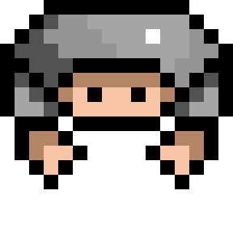

  

#  Spinny Knight

> A physics-based top-down arena brawler made for **JuniperDev's VERY SERIOUS Game Jam**, themed **"Spin To Win"**.

Built with **Godot 4.7** (GL Compatibility renderer, Jolt Physics).

## Overview

you control a knight that really likes to spin for some reason, you kill enemies by bumping your weapon of choice into their bodies. the game is sort of like a dungeon crawler in that you choose an upgrade after each level that persists for the rest of the game

---

## Controls

| Action | Primary Key | Alternate Key |
|---|---|---|
| Move Up | `W` | `↑`  |
| Move Down | `S` | `↓` |
| Move Left | `A` | `←`  |
| Move Right | `D` | `→`  |
| Rotate Left (Counter-Clockwise) | `Q` | `Z` |
| Rotate Right (Clockwise) | `E` | `X` |

### Movement Details

- The movement relies mainly on godot's built in physics engine, where instead of setting the velocity manually each frame, all movement is dependant on applying forces or impulses and letting the engine do the rest.

- Both movement and rotation have a braking effect when you try to move in the opposite direction than the one you are currently moving in, which applies a 2x force factor for faster deccelaration to provide more control.

---

## Weapons

| Weapon | Damage | Knockback |
|---|---|---|
|  **Sword**| 20 | 200 |
|  **Axe**| 40 | 300 |
|  **Spear**| 10 | 100 |

---

##  Enemies

Enemies operate on a **three-state AI**:

### State Machine

| State | Behaviour |
|---|---|
| **IDLE** | Stands still, applies velocity damping. Transitions to FOLLOW when the player enters detection range (`400 px` by default). |
| **FOLLOW** | Faces the player and applies movement force toward them. Transitions to ATTACK when within attack range (`100 px`). Returns to IDLE if the player stays out of detection range for `2 seconds`. |
| **ATTACK** | Charges the player with `3×` movement force and a higher speed cap. Lasts for `2 seconds`, then returns to IDLE. |

### Enemy Stats (Defaults)

| Stat | Value |
|---|---|
| Health | 200 |
| Body Damage | 10 |
| Detection Range | 400 px |
| Attack Range | 100 px |
| Weapon | Randomly picked from the weapon pool (Sword, Axe, or Spear), unless a specific weapon scene is assigned in the editor |

### Enemy Weapons

Enemies either use a weapon explicitly assigned via the `WEAPON_SCENE` export, or get a **random** weapon from the global weapon list on spawn.

---

## Combat & Damage

- Damage dealt by player to enemy = player base damage + weapon damage
- Damage dealt by enemy to player = weapon base damage
- if the enemy bumps into the player, the player takes a little bit of damage

### Knockback

On every hit:
1. A **linear impulse** pushes the enemies away from the point of impact.
2. An **angular (torque) impulse** spins the enemy.
3. The knockback magnitude comes from the attacker's weapon `KNOCKBACK` stat.

---

## Scoring System

The game features a **combo-based scoring system** managed by the level script:

| Event | Effect |
|---|---|
| Hit an enemy | Combo multiplier increases by `+1` |
| Kill an enemy | `+200 × combo multiplier` added to the level score |
| No hits for 3 seconds | Combo resets to `×1` |

- The **combo label** appears on-screen with a random slight rotation (±15°) and visually shrinks over the 3-second combo window as a countdown indicator.
- **Score display** shows both the running **Total Score** (across all levels) and the current **Level Score**.
- At the end of a level, the level score is added to the total score.

---

## Game Loop & Level Flow

### 1. Main Menu

- Choose your **weapon** (Sword, Axe, or Spear) from a dropdown.
- Settings are **saved** to a config file (`user://settings.cfg`) and restored on next launch.
- Press **Start** to begin.

### 2. Levels

- Each level is an **arena** — a rectangular area bounded by four `StaticBody2D` world boundaries (1152 × 648 px play area).
- The level starts with a **3-2-1-GO! countdown** during which the game is paused (`Engine.time_scale = 0`).
- The player and pre-placed enemies spawn into the arena.
- **Win condition**: Defeat all enemies in the level. When the `"enemy"` group is empty, a `"NICE"` message displays, and after a 2-second cooldown the level ends.

### 3. Between Levels (Upgrade Screen)

After completing a level, you're presented with **three upgrade choices** (pick one):

| Upgrade | Effect |
|---|---|
| Health | `+100` to max health |
| Damage | `+20` to player base damage |
| Speed | `+100` to movement speed |

Your current total score is displayed. After choosing, settings are saved and the next level loads.
- note that even tho the ui says it increases 1 speed, in the code it actually increases by a 100, which is intended since the amount of pushing force is meant to be something "internal" not representative of the "speed" value

### 4. End of Game

after the game ends you get to type your name and it gets saved to a leaderboard which you can see after hitting submit.

## Architecture

### Autoloads (Singletons)

| Autoload | Purpose |
|---|---|
| `GameState` | Stores player stats (weapon, speed, health, damage), weapon registry, level list, score tracking, settings save/load, and scene transitions. |
| `SignalBus` | Global event bus with two signals: `enemy_hit` and `enemy_died`, used to decouple the combo/score system from enemy logic. |

### Key Scripts

| Script | Location | Role |
|---|---|---|
| `game_state.gd` | `scripts/` | Autoloaded singleton — player stats, weapon registry, level list, score tracking, leaderboard persistence (top 10), settings save/load, and all scene transitions. |
| `player.gd` | `scripts/entities/` | Player movement, rotation, weapon equipping, health bar, damage/knockback handling, invincibility, death. |
| `enemy.gd` | `scripts/entities/` | Enemy AI state machine (IDLE/FOLLOW/ATTACK), player tracking, weapon equipping, health bar, damage/knockback handling, death. |
| `hit_box.gd` | `scripts/entities/` | Attached to weapon `Area2D`; provides `get_damage()` by reading from parent entity. |
| `level.gd` | `scripts/core/` | Level countdown, win detection, combo system, score tracking, level-end transition. |
| `main_menu.gd` | `scripts/core/` | Weapon selection UI, settings persistence, game start. |
| `between_levels.gd` | `scripts/core/` | Upgrade selection UI (health/damage/speed), stat application, level progression. |
| `end_menu.gd` | `scripts/core/` | Post-game score display and name entry; submits the player's score to the leaderboard. |
| `scores_menu.gd` | `scripts/core/` | Leaderboard screen — loads and displays the top 10 saved scores with rank, name, and score. |
| `signal_bus.gd` | `scripts/core/` | Autoloaded global event bus with `enemy_hit` and `enemy_died` signals. |
| `weapon.gd` | `scripts/weapons/` | Base weapon class with damage/knockback values and getters. |
| `sword.gd` / `axe.gd` / `spear.gd` | `scripts/weapons/` | Weapon subclasses that override damage/knockback in `_ready()`. |

### Collision Layers

The game uses bitmask-based collision layers to separate player, enemy, weapon, hurtbox, and hitbox interactions.

---

## Tech Stack

- **Engine**: Godot 4.7
- **Language**: GDScript
- **Physics**: Jolt Physics (3D engine setting, but the game is 2D — uses Godot's 2D `RigidBody2D` physics)
- **Renderer**: GL Compatibility (OpenGL) with D3D12 driver on Windows
- **License**: Apache 2.0
