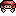
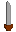
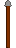

<p align="center">
  
</p>

#  Spinny Knight

> A physics-based top-down arena brawler made for **JuniperDev's VERY SERIOUS Game Jam**, themed **"Spin To Win"**.

Built with **Godot 4.7** (GL Compatibility renderer, Jolt Physics).

## Overview

you control a knight that really likes to spin for some reason, you kill enemies by bumping your weapon of choice into their bodies. the game is sort of like a dungeon crawler in that you choose an upgrade after each level that persists for the rest of the game

---

## Controls

| Action | Primary Key | Alternate Key |
|---|---|---|
| Move Up | `W` | `↑` Arrow |
| Move Down | `S` | `↓` Arrow |
| Move Left | `A` | `←` Arrow |
| Move Right | `D` | `→` Arrow |
| Rotate Left (Counter-Clockwise) | `Q` | `Z` |
| Rotate Right (Clockwise) | `E` | `X` |

### Movement Details

- The movement relies mainly on godot's built in physics engine, where instead of setting the velocity manually each frame, all movement is dependant on applying forces or impulses and letting the engine do the rest.

- Both movement and rotation have a braking effect when you try to move in the opposite direction than the one you are currently moving in, which applies a 2x force factor for faster deccelaration to provide more control.

---

## Weapons

| Weapon | Damage | Knockback |
|---|---|---|
|  **Sword**| 20 | 200 |
|  **Axe**| 40 | 300 |
|  **Spear**| 10 | 100 |

---

##  Enemies

Enemies operate on a **three-state AI**:

### State Machine

| State | Behaviour |
|---|---|
| **IDLE** | Stands still, applies velocity damping. Transitions to FOLLOW when the player enters detection range (`400 px` by default). |
| **FOLLOW** | Faces the player and applies movement force toward them at `100` force / `200 max speed`. Transitions to ATTACK when within attack range (`100 px`). Returns to IDLE if the player stays out of detection range for `2 seconds`. |
| **ATTACK** | Charges the player with `3×` movement force and a higher speed cap (`400`). Lasts for `2 seconds`, then returns to IDLE. |

### Enemy Stats (Defaults)

| Stat | Value |
|---|---|
| Health | 200 |
| Body Damage | 10 |
| Detection Range | 400 px |
| Attack Range | 100 px |
| Weapon | Randomly picked from the weapon pool (Sword, Axe, or Spear), unless a specific weapon scene is assigned in the editor |

### Enemy Weapons

Enemies either use a weapon explicitly assigned via the `WEAPON_SCENE` export, or get a **random** weapon from the global weapon list on spawn.

---

## 💥 Combat & Damage

### How Damage Works

- **Weapon hitboxes** (`Area2D` with the `HitBox` script) overlap with **hurtboxes** to trigger damage.
- When the **player** hits an enemy, the total damage dealt is **weapon damage + player body damage** (the player's `get_damage()` returns `10` base).
- When an **enemy** hits the player, damage equals the enemy weapon's damage value.

### Knockback

On every hit:
1. A **linear impulse** pushes the victim away from the point of impact.
2. An **angular (torque) impulse** spins the victim — the direction depends on which side the hit landed (calculated via a 2D cross product).
3. The knockback magnitude comes from the attacker's weapon `KNOCKBACK` stat.

### Hit Effects

- **Slow-motion**: On every hit, `Engine.time_scale` drops to `0.2` for `0.2` real-time seconds, creating a satisfying impact freeze.
- **Invincibility frames**: After being hit, both players and enemies become invincible for a short duration (player: `1.0s`, enemy: `0.25s`).
- **Hit particles**: Enemies emit a burst of yellow particles in the knockback direction when struck.

### Death

- **Enemy**: When health reaches `0`, the `enemy_died` signal fires (updating the score) and the enemy is removed from the scene via `queue_free()`.
- **Player**: ⚠️ **Player death is currently unfinished.**

---

## 🏆 Scoring System

The game features a **combo-based scoring system** managed by the level script:

| Event | Effect |
|---|---|
| Hit an enemy | Combo multiplier increases by `+1` |
| Kill an enemy | `+200 × combo multiplier` added to the level score |
| No hits for 3 seconds | Combo resets to `×1` |

- The **combo label** appears on-screen with a random slight rotation (±15°) and visually shrinks over the 3-second combo window as a countdown indicator.
- **Score display** shows both the running **Total Score** (across all levels) and the current **Level Score**.
- At the end of a level, the level score is added to the total score.

---

## 🔄 Game Loop & Level Flow

```
Main Menu  →  Level 1  →  Between Levels (Upgrade)  →  Level 2  →  repeat until last level -> Boss Level -> end screen
```

### 1. Main Menu

- Choose your **weapon** (Sword, Axe, or Spear) from a dropdown.
- Set your **movement speed** with a slider (range: `100` – `400`, default: `200`).
- Settings are **saved** to a config file (`user://settings.cfg`) and restored on next launch.
- Press **Start** to begin.

### 2. Levels

- Each level is an **arena** — a rectangular area bounded by four `StaticBody2D` world boundaries (1152 × 648 px play area).
- The level starts with a **3-2-1-GO! countdown** during which the game is paused (`Engine.time_scale = 0`).
- The player and pre-placed enemies spawn into the arena.
- **Win condition**: Defeat all enemies in the level. When the `"enemy"` group is empty, a `"NICE"` message displays, and after a 2-second cooldown the level ends.

### 3. Between Levels (Upgrade Screen)

After completing a level, you're presented with **three upgrade choices** (pick one):

| Upgrade | Effect |
|---|---|
| ❤️ Health | `+50` to max health |
| ⚔️ Damage | `+5` to player base damage |
| 💨 Speed | `+100` to movement speed |

Your current total score is displayed. After choosing, settings are saved and the next level loads.

> ⚠️ **Note:** There is a mismatch between the upgrade button labels in the scene (`+100 HEALTH`, `+1 SPEED`) and the actual script values (`+50 health`, `+100 speed`). The display text doesn't match the code.

### 4. End of Game

- Currently there are **2 levels** defined (`level1.tscn`, `level2.tscn`).
- ⚠️ **After the final level, the game loops back to the Main Menu** as a temporary measure. might add a boss level and end screen later.
- The `current_level` index resets to `0` when all levels are exhausted.

---

## 🏗️ Architecture

### Autoloads (Singletons)

| Autoload | Purpose |
|---|---|
| `GameState` | Stores player stats (weapon, speed, health, damage), weapon registry, level list, score tracking, settings save/load, and scene transitions. |
| `SignalBus` | Global event bus with two signals: `enemy_hit` and `enemy_died`, used to decouple the combo/score system from enemy logic. |

### Key Scripts

| Script | Role |
|---|---|
| `player.gd` | Player movement, rotation, weapon equipping, damage/knockback handling, invincibility, death. |
| `enemy.gd` | Enemy AI state machine, player tracking, weapon equipping, damage/knockback handling, death. |
| `level.gd` | Level countdown, win detection, combo system, score tracking, level-end transition. |
| `main_menu.gd` | Weapon/speed selection UI, settings persistence, game start. |
| `between_levels.gd` | Upgrade selection UI, stat application, level progression. |
| `weapon.gd` | Base weapon class with damage/knockback values and getters. |
| `sword.gd` / `axe.gd` / `spear.gd` | Weapon subclasses that override damage/knockback in `_ready()`. |
| `hit_box.gd` | Attached to weapon `Area2D`; provides `get_damage()` by reading from parent. |
| `signal_bus.gd` | Declares global signals for enemy hit/death events. |

### Collision Layers

The game uses bitmask-based collision layers to separate player, enemy, weapon, hurtbox, and hitbox interactions.

---

## 🛠️ Tech Stack

- **Engine**: Godot 4.7
- **Language**: GDScript
- **Physics**: Jolt Physics (3D engine setting, but the game is 2D — uses Godot's 2D `RigidBody2D` physics)
- **Renderer**: GL Compatibility (OpenGL) with D3D12 driver on Windows
- **License**: Apache 2.0
